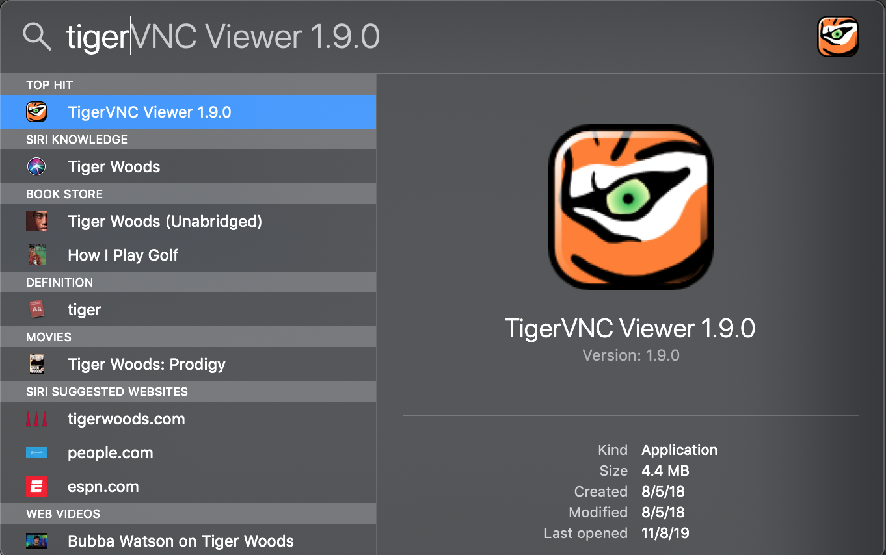
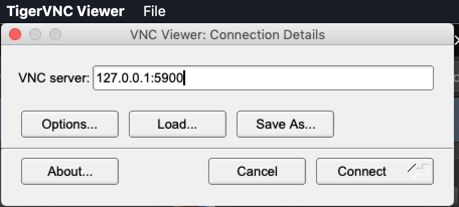

# lens-qemu

This project provides a Debian Linux Virtual Machine disk image that has Lens pre-installed in `/app/Lens-linux`.
This image can be virtualized with QEMU.

See [Windows](docs/Windows.md) for compatiblity with Win10.

## Quick Start on MacOS

### Download and run the virtual machine

```
brew install qemu wget
git clone https://projects.sisrlab.com/cap-lab/lens-qemu.git
cd lens-qemu
make download-image run
```

### Connect to the virtual machine using VNC

```
brew cask install tigervnc-viewer
```

Tiger VNC is now available in `/Applications`.
Launch Tiger VNC with Spotlight.



Using Tiger VNC, connect to `127.0.0.1:5900`.



### Login

- username is `idm` and password is `debian`
- root password is also `debian`

### Launch Lens

Launch a terminal from the dock.
Then, launch Lens.

```
cd /app/Lens-linux
./Bin/lens.sh
```

## Common tasks

### ssh

`ssh` is available on port 2222:

```
ssh -p2222 idm@127.0.0.1
```

### scp

Use `scp` to move files to/from the image.

```
scp -P2222 -r Lens-dist/ idm@127.0.0.1:/app/Lens-linux
```

## References

- [Instructions for Bootstrapping a new disk image](docs/Bootstrap.md)
- http://tedlab.mit.edu/~dr/Lens/installing.html
