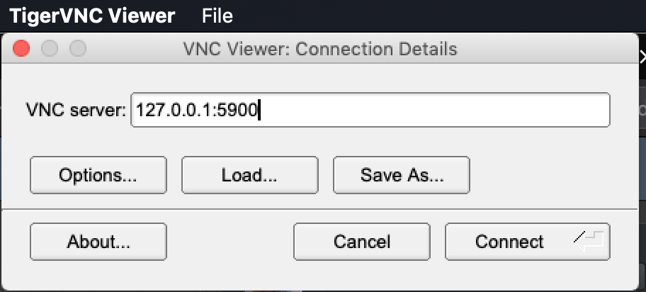

# Installing and Using Tiger VNC

First, install Tiger VNC using Homebrew.

```
brew cask install tigervnc-viewer
```

Tiger VNC is now available in `/Applications`.
Launch Tiger VNC with Spotlight.


Using Tiger VNC, connect to `127.0.0.1:5900`.



