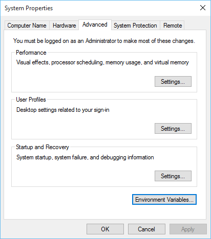

# Windows

## Installing QEMU

Download the latest version of QEMU from here: https://qemu.weilnetz.de/w64/

### Add QEMU to Path

- At the start menu, type "environment variable" and click "edit the system environment variables" in the Control Panel
- In the window that opens, click "Environment Variables" at the bottom of the window
- Under "user variables" click `Path` and click `Edit`
- Click `New` to add a new directory to the path
- The new directory is `C:\Program Files\QEMU`

## Win10 with WHPX acceleration

To use the Windows Hypervisor (if it is available), edit `Makefile` to uncomment `HYPERVISOR=whpx`.

## Other Windows with Intel HAXM acceleration

To use the Intel HAXM accelerator, edit `Makefile` to uncomment `HYPERVISOR=hax`.

### Installing HAXM

Intel Hardware Accelerated Extension Manager (HAXM) is required for acceleration on Windows.
HAXM is also required for i386 virtualization on both MacOS and Windows.

- [Download v7.5.4](https://github.com/intel/haxm/releases/tag/v7.5.4)
- [All HAXM releases](https://github.com/intel/haxm/tags)
- [Instructions for MacOS](https://github.com/intel/haxm/wiki/Installation-Instructions-on-macOS)
